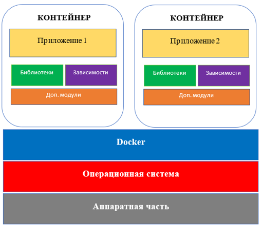

# Docker Escape (побег из контейнера)

Несколько слов о том, что такое Docker

## Что такое Docker

**Docker** — это платформа контейнеризации с открытым исходным кодом, с помощью которой можно автоматизировать создание приложений, их доставку и управление. Платформа позволяет быстрее тестировать и выкладывать приложения, запускать на одной машине требуемое количество контейнеров.

На следующем рисунке представлено, как ранее выглядела архитектура (в очень упрощенном виде) приложений


Видим, что под каждое приложение нужна целая операционная система, которая потребляет большое количество ресурсов

С появлением контейнеров архитектура стала выглядеть следующим образом:



Ну и на самом деле зачастую сейчас можно встретить следующий вариант архиткетуры:


**Теперь перейдем к основной теме занятия**

## Что такое Docker Escape

Docker Escape — это атаки, направленные на обход изоляции контейнеров и 
получение доступа к хост-системе или другим контейнерам

Но прежде чем продолжать, необходимо подготовить рабочее окружение

Для начала проверим, установлен ли на машине docker

```bash
sudo docker version
sudo usermod -aG docker ${USER}
docker version
```

Если не установлен, следуйте инструкциям представленным на локальной wiki

В сети заберите файл под названием **base_image.tar** и выполните следующею команду:

```bash
docker load -i base_image.tar
```

После этого у вас будет рабочий образ, который нужно использовать в ходе занятия

Проверить это можно при помощи команды docker images. При необходимости можете переименовать образ с использованием команды
```bash
docker tag image_id ubuntu_golden_image:v01
```
для того, чтобы можно было просто копировать команды из данного репозитория

Далее мы рассмотрим, что происходит при выполнении команды docker, а также что из себя представляет изоляция контейнеров

## Изоляция контейнеров

Изоляция контейнеров основана на двух механизмах: namespace и cgroup.

### Namespaces

**Пространства имен** – это одна из особенностей ядра Linux, введенная в версии 2.6.24 в 2008 году. Они обеспечивают процессы собственным системным представлением, тем самым изолируя независимые процессы друг от друга. Другими словами, пространства имен определяют набор ресурсов, которые может использовать процесс (нельзя взаимодействовать с тем, что не видно). На высоком уровне они позволяют тонко разделять глобальные ресурсы операционной системы, такие как точки монтирования, сетевой стек и утилиты межпроцессного взаимодействия.

Сильная сторона пространств имен в том, что они ограничивают доступ к системным ресурсам без информирования об этом выполняющегося процесса. В Linux они обычно представлены как файлы в директории **/proc/pid/ns**.

### Cgroups

**Cgroups** - это механизм в ядре Linux, который позволяет ограничивать и 
контролировать ресурсы, доступные процессам

Информация о них доступна по пути **/sys/fs/cgroups**

Docker использует cgroups для управления ресурсами контейнера, такими как CPU и память. Это позволяет предотвращать атаки, связанные с исчерпанием ресурсов, и обеспечивать предсказуемую производительность контейнеров

### Если говорить кратко, то namespace позволяют ограничивать области видимости, а cgroups количество потребляемых ресурсов


### Подробнее о пространствах имен

* При порождении нового процесса, он наследует все пространства имен от своего родителя.

Пространства имен создаются с помощью системного вызова clone, сопровождаемого одним из следующих аргументов:

- CLONE_NEWNS – новое пространство имен mount;
- CLONE_NEWUTS – новое пространство имен UTS;
- CLONE_NEWIPC – новое пространство имен IPC;
- CLONE_NEWPID – новое пространство имен PID;
- CLONE_NEWNET – новое пространство имен NET;
- CLONE_NEWUSER – новое пространство имен USR;
- CLONE_NEWCGROUP – новое пространство имен cgroup.


**Есть семь типов пространств имен**:

* PID: изоляция дерева системных процессов;
* NET: изоляция сетевого стека хоста;
* MNT: изоляция точек монтирования файловой системы хоста;
* UTS: изоляция имени хоста;
* IPC: изоляция утилит межпроцессного взаимодействия (сегменты разделяемой памяти, семафоры);
* USER: изоляция ID пользователей системы;
* CGROUP: изоляция виртуальной файловой системы cgroup хоста.

Далее выполним следующие команды:

```bash
ls /proc/$$/ns –al
sudo lsns
ps aux | wc -l
```

Отсюда можно сделать вывод, что существует набор default namespace, в который попадают практически все процессы в системе

Попробуем запустить процесс в новом пространстве имен

```bash
ls –l /proc/$$/ns
sudo unshare --uts zsh
ls –l /proc/$$/ns
hostname test
```

Видим, что namespace uts имеют разные идентификаторы и мы можем установить разные hostname.

На следующем изображении можно увидеть, что означает изоляция дерева процессов


Таким образом, уже можно заметить отличительные черты контейнеров, создаваемых при помощи docker (если вспомнить, какое имя хоста внутри контейнера и что процессы в контейнере начинаются с 1)

Что же происходит, когда мы вводим команду:
```bash
docker run –rm –name test –d alpine ping 8.8.8.8
```

Введем следующую команду:

```bash
sudo lsns | tail –n 7
```

Заметим, что Docker создает 6 типов namespace для создаваемого контейнера

Теперь посмотрим, что скрывается за следующей командой: 

```bash
docker exec -it test bash
```

На самом деле, попасть в контейнер можно и средствами командной строки (без утилиты docker). Вот пример, как можно менять namespace с использованием системного вызова nsenter:

```bash
sudo nsenter –t container_pid --mount –-uts –ipc –net –cgroup /bin/bash
```

### Capabilities

Позволяют предоставить программам доступ к определённым возможностям, которые обычно есть только у суперпользователя, позволяя избежать запуска программ от имени root.
Когда Docker контейнер создается, по умолчанию ему назначаются ограниченные capabilities. Это означает, что даже если процесс в контейнере запущен с правами root, он не имеет полных привилегий, как на хост-системе. Это ограничивает потенциальные атаки внутри контейнера.

Посмотреть их можно с помощью следующих команд:

```bash
getcap –r /
cat /proc/self/status | grep –i cap
```

Либо так:
```bash
capsh –-print
```
Эта утилита содержится в libcap

> apk add libcap

> apt install libcap2-bin

> dnf install libcap 

### Запустим контейнер с флагом privileged и без него

```bash
docker run -it --privileged --rm ubuntu_golden_image:v01 bash
capsh --print
```

```bash
docker run -it --rm ubuntu_golden_image:v01 bash
capsh --print
```

**--privileged – запускает контейнер со всеми capabilities**


## Несколько слов про Apparmor
> docker ps --quiet --all | xargs docker inspect --format '{{ .Name }}: AppArmorProfile={{ .AppArmorProfile }}'

По сути представляет из себя мандатное разграничение доступа (указывается, что можно делать, а что нельзя с использованием белых списков)

Большинство техник побега из контейнера основывается на том, что контейнеру выданы "лишние" Capabilities
