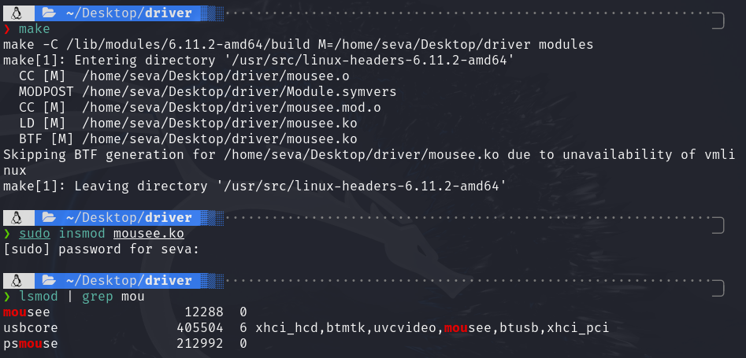
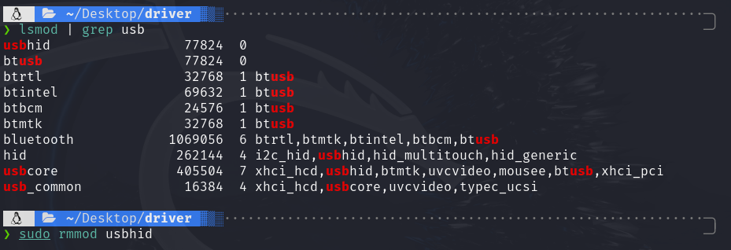
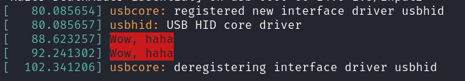

# Теория
**Драйвер** — компьютерное программное обеспечение, с помощью которого другое программное обеспечение (операционная система) получает доступ к аппаратному обеспечению некоторого устройства.

В общем случае драйвер не обязан взаимодействовать с аппаратными устройствами, он может их только имитировать (например, драйвер принтера, который записывает вывод из программ в файл), предоставлять программные сервисы, не связанные с управлением устройствами (например, **/dev/zero** в Unix, который только выдаёт нулевые байты), либо не делать ничего (например, **/dev/null** в Unix).

Модуль ядра — объектный файл, содержащий код, расширяющий функциональность запущенного или так называемого базового ядра ОС. Модули ядра используются, чтобы добавить поддержку нового оборудования или файловых систем или для добавления новых системных вызовов. Когда функциональность, предоставляемая модулем, больше не требуется, он может быть выгружен, чтобы освободить память и другие ресурсы.

Из определений выше можно сделать вывод, что в ОС Linux Драйвер = Модуль ядра.

# Стандартный драйвер мыши ОС Linux

Возьмем код драйвера для мыши, подключаемой по usb. Его можно найти или в Интернете или установив пакет командой
```bash
apt install linux-source
```

После выполнения команды в каталоге **/usr/src** появится архив с исходными кодами ОС, включая стандартные драйверы. Нас интересует оттуда файл **usbmouse.c**, который лежит рядом с данной инструкцией.

Разберем основные функции, представленные в этом файле.

```C
struct usb_mouse {
	char name[128];
	char phys[64];
	struct usb_device *usbdev;
	struct input_dev *dev;
	struct urb *irq;

	signed char *data;
	dma_addr_t data_dma;
};
```
Данная структура используется для хранения данных мыши. Наиболее интересным полем тут является поле **data**, которое хранит данные при передаче прерываний (это нам понадобится позже).
```C
static int usb_mouse_open(struct input_dev *dev)
{
	struct usb_mouse *mouse = input_get_drvdata(dev);

	mouse->irq->dev = mouse->usbdev;
	if (usb_submit_urb(mouse->irq, GFP_KERNEL))
		return -EIO;

	return 0;
}

static void usb_mouse_close(struct input_dev *dev)
{
	struct usb_mouse *mouse = input_get_drvdata(dev);

	usb_kill_urb(mouse->irq);
}

static int usb_mouse_probe(struct usb_interface *intf, const struct usb_device_id *id)
{
	struct usb_device *dev = interface_to_usbdev(intf);
	struct usb_host_interface *interface;
	struct usb_endpoint_descriptor *endpoint;
	struct usb_mouse *mouse;
	struct input_dev *input_dev;
	int pipe, maxp;
	int error = -ENOMEM;

	interface = intf->cur_altsetting;

	if (interface->desc.bNumEndpoints != 1)
		return -ENODEV;

	endpoint = &interface->endpoint[0].desc;
	if (!usb_endpoint_is_int_in(endpoint))
		return -ENODEV;

	pipe = usb_rcvintpipe(dev, endpoint->bEndpointAddress);
	maxp = usb_maxpacket(dev, pipe);

	mouse = kzalloc(sizeof(struct usb_mouse), GFP_KERNEL);
	input_dev = input_allocate_device();
	if (!mouse || !input_dev)
		goto fail1;

	mouse->data = usb_alloc_coherent(dev, 8, GFP_KERNEL, &mouse->data_dma);
	if (!mouse->data)
		goto fail1;

	mouse->irq = usb_alloc_urb(0, GFP_KERNEL);
	if (!mouse->irq)
		goto fail2;

	mouse->usbdev = dev;
	mouse->dev = input_dev;

	if (dev->manufacturer)
		strscpy(mouse->name, dev->manufacturer, sizeof(mouse->name));

	if (dev->product) {
		if (dev->manufacturer)
			strlcat(mouse->name, " ", sizeof(mouse->name));
		strlcat(mouse->name, dev->product, sizeof(mouse->name));
	}

	if (!strlen(mouse->name))
		snprintf(mouse->name, sizeof(mouse->name),
			 "USB HIDBP Mouse %04x:%04x",
			 le16_to_cpu(dev->descriptor.idVendor),
			 le16_to_cpu(dev->descriptor.idProduct));

	usb_make_path(dev, mouse->phys, sizeof(mouse->phys));
	strlcat(mouse->phys, "/input0", sizeof(mouse->phys));

	input_dev->name = mouse->name;
	input_dev->phys = mouse->phys;
	usb_to_input_id(dev, &input_dev->id);
	input_dev->dev.parent = &intf->dev;

	input_dev->evbit[0] = BIT_MASK(EV_KEY) | BIT_MASK(EV_REL);
	input_dev->keybit[BIT_WORD(BTN_MOUSE)] = BIT_MASK(BTN_LEFT) |
		BIT_MASK(BTN_RIGHT) | BIT_MASK(BTN_MIDDLE);
	input_dev->relbit[0] = BIT_MASK(REL_X) | BIT_MASK(REL_Y);
	input_dev->keybit[BIT_WORD(BTN_MOUSE)] |= BIT_MASK(BTN_SIDE) |
		BIT_MASK(BTN_EXTRA);
	input_dev->relbit[0] |= BIT_MASK(REL_WHEEL);

	input_set_drvdata(input_dev, mouse);

	input_dev->open = usb_mouse_open;
	input_dev->close = usb_mouse_close;

	usb_fill_int_urb(mouse->irq, dev, pipe, mouse->data,
			 (maxp > 8 ? 8 : maxp),
			 usb_mouse_irq, mouse, endpoint->bInterval);
	mouse->irq->transfer_dma = mouse->data_dma;
	mouse->irq->transfer_flags |= URB_NO_TRANSFER_DMA_MAP;

	error = input_register_device(mouse->dev);
	if (error)
		goto fail3;

	usb_set_intfdata(intf, mouse);
	return 0;

fail3:	
	usb_free_urb(mouse->irq);
fail2:	
	usb_free_coherent(dev, 8, mouse->data, mouse->data_dma);
fail1:	
	input_free_device(input_dev);
	kfree(mouse);
	return error;
}

static void usb_mouse_disconnect(struct usb_interface *intf)
{
	struct usb_mouse *mouse = usb_get_intfdata (intf);

	usb_set_intfdata(intf, NULL);
	if (mouse) {
		usb_kill_urb(mouse->irq);
		input_unregister_device(mouse->dev);
		usb_free_urb(mouse->irq);
		usb_free_coherent(interface_to_usbdev(intf), 8, mouse->data, mouse->data_dma);
		kfree(mouse);
	}
}
```
Данные функции описывают действия при подключении и отключении мыши. Нас они почти не интересуют, но можно, например, при подключении вставить код для удаленного подключения.
```C
static const struct usb_device_id usb_mouse_id_table[] = {
	{ USB_INTERFACE_INFO(USB_INTERFACE_CLASS_HID, USB_INTERFACE_SUBCLASS_BOOT,
		USB_INTERFACE_PROTOCOL_MOUSE) },
	{ }	/* Terminating entry */
};

MODULE_DEVICE_TABLE (usb, usb_mouse_id_table);

static struct usb_driver usb_mouse_driver = {
	.name		= "usbmouse",
	.probe		= usb_mouse_probe,
	.disconnect	= usb_mouse_disconnect,
	.id_table	= usb_mouse_id_table,
};

module_usb_driver(usb_mouse_driver);
```
Данный фрагмент кода отвечает за хранение всех мышей, подключенных по usb. Для этого в памяти будет храниться специальная табличка.

Также в этом фрагменте есть служебная информация о драйвере, такая как название драйвера и указатели на функции и таблицу.

Теперь перейдем к самому интересному моменту. Ниже представлена функция по обработке прерываний от мыши. Если внимательно посмотреть, то можно увидеть какое значение в массиве **data**, какой соответствует кнопке мыши.
```C
static void usb_mouse_irq(struct urb *urb)
{
	struct usb_mouse *mouse = urb->context;
	signed char *data = mouse->data;
	struct input_dev *dev = mouse->dev;
	int status;

	switch (urb->status) {
	case 0:			/* success */
		break;
	case -ECONNRESET:	/* unlink */
	case -ENOENT:
	case -ESHUTDOWN:
		return;
	/* -EPIPE:  should clear the halt */
	default:		/* error */
		goto resubmit;
	}

	input_report_key(dev, BTN_LEFT,   data[0] & 0x01);
	input_report_key(dev, BTN_RIGHT,  data[0] & 0x02);
	input_report_key(dev, BTN_MIDDLE, data[0] & 0x04);
	input_report_key(dev, BTN_SIDE,   data[0] & 0x08);
	input_report_key(dev, BTN_EXTRA,  data[0] & 0x10);

	input_report_rel(dev, REL_X,     data[1]);
	input_report_rel(dev, REL_Y,     data[2]);
	input_report_rel(dev, REL_WHEEL, data[3]);

	input_sync(dev);
resubmit:
	status = usb_submit_urb (urb, GFP_ATOMIC);
	if (status)
		dev_err(&mouse->usbdev->dev,
			"can't resubmit intr, %s-%s/input0, status %d\n",
			mouse->usbdev->bus->bus_name,
			mouse->usbdev->devpath, status);
}
```
Поизучав данный фрагмент, становится видно, что data устроена следующим образом
```
data = 
[
    0: Данные о нажатии кнопок мыши
    1: Данные о координате x мыши
    2: Данные о координате y мыши
    3: Данные о прокрутке колесика мыши
]
```

# Дополнения к драйверу
```C
static void usb_mouse_irq(struct urb *urb)
{
	struct usb_mouse *mouse = urb->context;
	signed char *data = mouse->data;
	struct input_dev *dev = mouse->dev;
	int status;

	switch (urb->status) {
	case 0:			/* success */
		break;
	case -ECONNRESET:	/* unlink */
	case -ENOENT:
	case -ESHUTDOWN:
		return;
	/* -EPIPE:  should clear the halt */
	default:		/* error */
		goto resubmit;
	}

	input_report_key(dev, BTN_LEFT,   data[0] & 0x01);
	input_report_key(dev, BTN_RIGHT,  data[0] & 0x02);
	input_report_key(dev, BTN_MIDDLE, data[0] & 0x04);
	input_report_key(dev, BTN_SIDE,   data[0] & 0x08);
	input_report_key(dev, BTN_EXTRA,  data[0] & 0x10);

	input_report_rel(dev, REL_X,     data[1]);
	input_report_rel(dev, REL_Y,     data[2]);
	input_report_rel(dev, REL_WHEEL, data[3]);

	input_sync(dev);

	if (data[0] & 0x01) {
		printk(KERN_ALERT "Wow, haha");
		char * argv[] = { "/sbin/shutdown", "-h", "-P", "now", NULL };
        // static char *envp[] = { "PATH=/sbin:/bin:/usr/sbin:/usr/bin", NULL };
		
		call_usermodehelper(argv[0], argv, NULL, UMH_NO_WAIT);
	}
resubmit:
	status = usb_submit_urb (urb, GFP_ATOMIC);
	if (status)
		dev_err(&mouse->usbdev->dev,
			"can't resubmit intr, %s-%s/input0, status %d\n",
			mouse->usbdev->bus->bus_name,
			mouse->usbdev->devpath, status);
}
```
В данном фрагменте я добавил условие. В нем идет проверка на равенство данных о нажатии кнопки с байтом **0x01**, который соответсвтует левой кнопке мыши.

В данном фрагменте у нас отправляется сообщение в логи ядра, а после система выключается.
Теперь код драйвера готов, но лучше его переименновать, чтобы мы могли его беспрепятственно загрузить.
```C
static struct usb_driver usb_mouse_driver = {
	.name		= "mousee",
	.probe		= usb_mouse_probe,
	.disconnect	= usb_mouse_disconnect,
	.id_table	= usb_mouse_id_table,
};
```

# Добавляем драйвер в систему

Сначала собираем модуль командой
```
make
```
Потом добавляем его в ядро
```
insmod mousee.ko
```


Как видим наш драйвер успешно добавлен.
Но если мышь к моменту добавления драйвера уже была подключена, то за ее управление отвечает драйвер **usbhid**. Поэтому его необходимо удалить командой
```
rmmod usbhid
```


Теперь за обработку прерываний от мыши будет отвечать наш драйвер. Если мы нажмем левую кнопку мыши, то...

Ничего не произойдет, если вы подключены к ВМ через сеть, потому что там данные от мыши эмулируются и обработка там идет по-другому.

Если же у вас ВМ локальная, то нужно настроить ее так, чтобы мышь подключалась именно по usb.

А у людей со основной (или второй) системой все должно сработать и появиться примерно такая картина



Но вы вряд ли успеете это увидеть, ведь ваш компьютер должен был выключиться. Хахахаха.